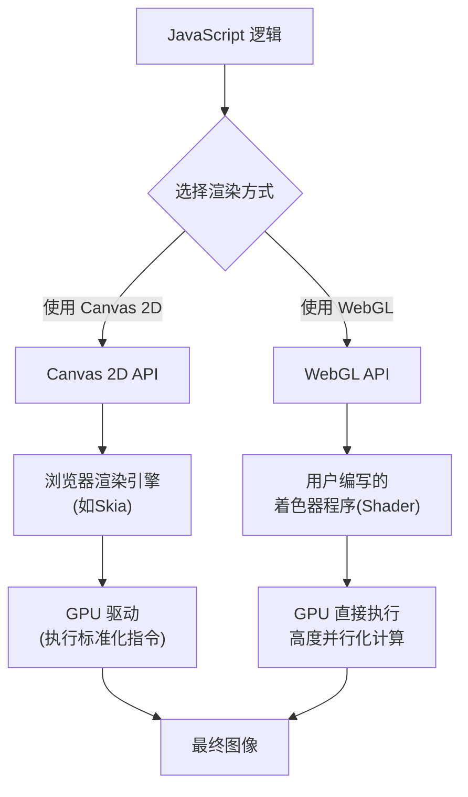

# 请给出Canvas与WebGL性能对比示例

结合我的经验，特别是参与数据可视化平台建设的经历，我认为 **Canvas 2D 和 WebGL 的性能差异根源在于它们与浏览器渲染管线的交互层级不同**。简单来说，
- Canvas 2D 是一个"高级"的绘图API
- WebGL 则允许我们进行"底层"的GPU编程

下面我通过一个具体的性能对比示例来详细解释。

### 核心原理：渲染层级的天壤之别

为了更直观地理解两者的性能差异，我们首先需要明白它们在浏览器中是如何工作的。下图清晰地展示了它们截然不同的渲染路径：



这个差异是性能差距的根本原因。Canvas 2D 的指令需要经过浏览器渲染引擎的"翻译"，而 WebGL 则允许开发者直接通过着色器向GPU"喊话"，实现了更高效的并行处理。

### 性能对比示例：渲染大量动态粒子

我们来构建一个经典场景：渲染大量随机运动的粒子。这是检验图形性能的试金石。

#### 1. Canvas 2D 实现方式

在这种方式下，我们使用熟悉的 `ctx.fillRect()` 等API，逻辑简单直接。

```html
<!DOCTYPE html>
<html lang="zh-CN">
<head>
    <meta charset="UTF-8">
    <title>Canvas 2D 粒子测试</title>
    <style> #canvas { border: 1px solid #ccc; } </style>
</head>
<body>
    <canvas id="canvas" width="800" height="600"></canvas>
    <script>
        const canvas = document.getElementById('canvas');
        const ctx = canvas.getContext('2d');
        const particleCount = 2000; // 粒子数量
        const particles = [];

        // 初始化粒子数据
        for (let i = 0; i < particleCount; i++) {
            particles.push({
                x: Math.random() * canvas.width,
                y: Math.random() * canvas.height,
                vx: (Math.random() - 0.5) * 2,
                vy: (Math.random() - 0.5) * 2,
                radius: Math.random() * 2 + 1,
                color: `hsl(${Math.random() * 360}, 100%, 50%)`
            });
        }

        function animate() {
            // 清空画布：这是必需的，但也是性能开销点之一
            ctx.clearRect(0, 0, canvas.width, canvas.height);

            for (let i = 0; i < particles.length; i++) {
                const p = particles[i];

                // 更新位置
                p.x += p.vx;
                p.y += p.vy;

                // 边界检查
                if (p.x < 0 || p.x > canvas.width) p.vx *= -1;
                if (p.y < 0 || p.y > canvas.height) p.vy *= -1;

                // 绘制每个粒子：CPU需要逐个计算并发出绘制指令
                ctx.beginPath();
                ctx.arc(p.x, p.y, p.radius, 0, Math.PI * 2);
                ctx.fillStyle = p.color;
                ctx.fill();
            }
            requestAnimationFrame(animate);
        }
        animate();
    </script>
</body>
</html>
```

[](https://github.com/dushenyan/picx-images-hosting/raw/master/mainsibaodian/image-2.6ikr1hi2bo.webp)

**性能瓶颈分析**：
-   **CPU 密集型**：动画的每一帧，JavaScript 都需要遍历所有粒子，计算新位置，然后通过 `ctx.arc()` 和 `ctx.fill()` 向浏览器发出成千上万个独立的绘图命令。
-   **指令开销大**：每个绘图指令（如 `beginPath()`, `arc()`, `fill()`）都有调用开销。浏览器需要接收这些高级指令，再将其转换为底层图形调用（例如通过 Skia 图形库），最终才由 GPU 执行。这个过程在数据量大时非常耗时。
-   **单线程限制**：所有这些计算和绘图指令都在浏览器的主线程中执行，如果计算量过大，会阻塞UI响应，导致页面卡顿。

当粒子数量上升到 5000 甚至 10000 时，Canvas 2D 版本很难维持 60fps 的流畅帧率。

#### 2. WebGL 实现方式（概念与关键代码）

WebGL 的实现要复杂得多，但其核心思想是 **将数据和计算逻辑最大限度地转移至 GPU**。

```html
<!DOCTYPE html>
<html lang="zh-CN">
<head>
    <meta charset="UTF-8">
    <title>WebGL 粒子测试</title>
    <style> #webglCanvas { border: 1px solid #ccc; } </style>
</head>
<body>
    <canvas id="webglCanvas" width="800" height="600"></canvas>
    <script>
        const canvas = document.getElementById('webglCanvas');
        const gl = canvas.getContext('webgl');
        const particleCount = 2000;

        // —————————— 1. 准备着色器程序 ——————————
        // 顶点着色器：负责每个顶点的位置和大小
        const vertexShaderSource = `
            attribute vec2 a_position;
            attribute float a_size;
            attribute vec3 a_color;
            uniform float u_time;
            varying vec3 v_color; // 将颜色传递给片元着色器

            void main() {
                // 简单的运动计算：可以在着色器里用数学公式实现
                vec2 displacement = vec2(sin(u_time + a_position.x * 0.01), cos(u_time + a_position.y * 0.01)) * 10.0;
                vec2 position = a_position + displacement;
                // 将坐标转换为WebGL所需的裁剪空间坐标
                gl_Position = vec4(position / vec2(800, 600) * 2.0 - 1.0, 0.0, 1.0);
                gl_PointSize = a_size;
                v_color = a_color;
            }
        `;
        
        // 片元着色器：负责每个像素的颜色
        const fragmentShaderSource = `
            precision mediump float;
            varying vec3 v_color;
            void main() {
                // 绘制圆点而非方形
                vec2 coord = gl_PointCoord - vec2(0.5);
                if(length(coord) > 0.5) discard;
                gl_FragColor = vec4(v_color, 1.0);
            }
        `;
        
        // 编译顶点着色器
        const vertexShader = gl.createShader(gl.VERTEX_SHADER);
        gl.shaderSource(vertexShader, vertexShaderSource);
        gl.compileShader(vertexShader);
        
        // 编译片元着色器
        const fragmentShader = gl.createShader(gl.FRAGMENT_SHADER);
        gl.shaderSource(fragmentShader, fragmentShaderSource);
        gl.compileShader(fragmentShader);
        
        // 创建着色器程序
        const program = gl.createProgram();
        gl.attachShader(program, vertexShader);
        gl.attachShader(program, fragmentShader);
        gl.linkProgram(program);
        gl.useProgram(program);

        // —————————— 2. 将粒子数据一次性送入GPU缓冲区 ——————————
        const positions = new Float32Array(particleCount * 2);
        const sizes = new Float32Array(particleCount);
        const colors = new Float32Array(particleCount * 3);
        
        // 填充初始数据
        for (let i = 0; i < particleCount; i++) {
            positions[i * 2] = Math.random() * canvas.width;
            positions[i * 2 + 1] = Math.random() * canvas.height;
            sizes[i] = Math.random() * 2 + 1;
            colors[i * 3] = Math.random();     // R
            colors[i * 3 + 1] = Math.random(); // G
            colors[i * 3 + 2] = Math.random(); // B
        }
        
        // 创建和配置位置缓冲区
        const positionBuffer = gl.createBuffer();
        gl.bindBuffer(gl.ARRAY_BUFFER, positionBuffer);
        gl.bufferData(gl.ARRAY_BUFFER, positions, gl.STATIC_DRAW);
        
        const positionAttributeLocation = gl.getAttribLocation(program, "a_position");
        gl.vertexAttribPointer(positionAttributeLocation, 2, gl.FLOAT, false, 0, 0);
        gl.enableVertexAttribArray(positionAttributeLocation);
        
        // 创建和配置大小缓冲区
        const sizeBuffer = gl.createBuffer();
        gl.bindBuffer(gl.ARRAY_BUFFER, sizeBuffer);
        gl.bufferData(gl.ARRAY_BUFFER, sizes, gl.STATIC_DRAW);
        
        const sizeAttributeLocation = gl.getAttribLocation(program, "a_size");
        gl.vertexAttribPointer(sizeAttributeLocation, 1, gl.FLOAT, false, 0, 0);
        gl.enableVertexAttribArray(sizeAttributeLocation);
        
        // 创建和配置颜色缓冲区
        const colorBuffer = gl.createBuffer();
        gl.bindBuffer(gl.ARRAY_BUFFER, colorBuffer);
        gl.bufferData(gl.ARRAY_BUFFER, colors, gl.STATIC_DRAW);
        
        const colorAttributeLocation = gl.getAttribLocation(program, "a_color");
        gl.vertexAttribPointer(colorAttributeLocation, 3, gl.FLOAT, false, 0, 0);
        gl.enableVertexAttribArray(colorAttributeLocation);
        
        // 设置清除颜色为黑色
        gl.clearColor(0, 0, 0, 1);

        function animate(time) {
            // —————————— 3. 渲染循环 ——————————
            // 更新统一的时间变量，驱动动画
            const timeUniformLocation = gl.getUniformLocation(program, "u_time");
            gl.uniform1f(timeUniformLocation, time * 0.001); // 转换为秒

            gl.clear(gl.COLOR_BUFFER_BIT);
            // 单次绘制调用：一次性绘制所有粒子！
            gl.drawArrays(gl.POINTS, 0, particleCount);
            requestAnimationFrame(animate);
        }
        animate(0);
    </script>
</body>
</html>
```

[](https://github.com/dushenyan/picx-images-hosting/raw/master/mainsibaodian/image-3.6ikr1hi2bp.webp)

**高性能原理分析**：
-   **数据驱动与并行计算**：我们将所有粒子的初始位置、大小、颜色等属性一次性打包并上传到GPU的缓冲区中。在动画循环中，我们不再用JS逐个更新粒子状态，而是通过一个统一的 `u_time` 变量，在**顶点着色器**中利用数学公式并行地为所有顶点计算位移。GPU拥有数百个核心，可以同时处理所有顶点的计算，这是速度飞跃的关键。
-   **单次绘制调用（Draw Call）**：整个场景的渲染通过一次 `gl.drawArrays(gl.POINTS, 0, particleCount)` 调用完成。这与Canvas 2D的数千次调用形成鲜明对比，极大地减少了CPU与GPU之间的通信开销。
-   **渲染管线优化**：WebGL允许开发者直接控制渲染管线中的顶点着色器和片元着色器，能够实现极其高效的定制化渲染逻辑，如实例化渲染（Instancing）等高级优化技术。

### 何时选择？一张表格看清

| 特性 | Canvas 2D | WebGL |
| :--- | :--- | :--- |
| **学习曲线** | 平缓，API 直观易懂 | 陡峭，需理解图形学概念和GLSL |
| **性能瓶颈** | **CPU**（大量JS绘图指令） | **GPU**（顶点和片元计算复杂度） |
| **最佳场景** | 静态或简单动画的2D图形、交互式图表（点数<5000）、小游戏 | **复杂3D场景**、海量数据点可视化（>1万点）、需要高级视觉效果（光影、粒子系统） |
| **开发效率** | 高，适合快速原型和简单需求 | 低，但可借助Three.js等库简化 |
| **兼容性** | 近乎100%的现代浏览器 | 良好，但部分老旧浏览器可能不支持 |

### 💎 总结

面试官，可以这样概括：

把图形渲染比作在工地上搬砖。
-   **Canvas 2D** 就像我亲自指挥一群工人（CPU核心），告诉他们"你，去东边放一块红砖；你，去西边放一块蓝砖"。工人数量有限（JS单线程为主），活一多就忙不过来，指挥过程本身也耗时。
-   **WebGL** 则像是直接把施工图纸（着色器程序）和所有砖块材料（顶点数据）交给一台高效的自动化砌墙机（GPU）。这台机器有数百只机械臂，可以同时砌所有的砖，我只需要按一下启动按钮（一次Draw Call）。

因此，对于**大规模、高频率更新**的图形场景，WebGL通过其**数据驱动、并行计算**的模型，性能优势是**数量级级别**的。而Canvas 2D在**中小规模、开发效率优先**的2D场景中，依然是绝佳选择。在实际项目中，我们需要根据具体的业务需求、数据量和团队技术储备来做技术选型。